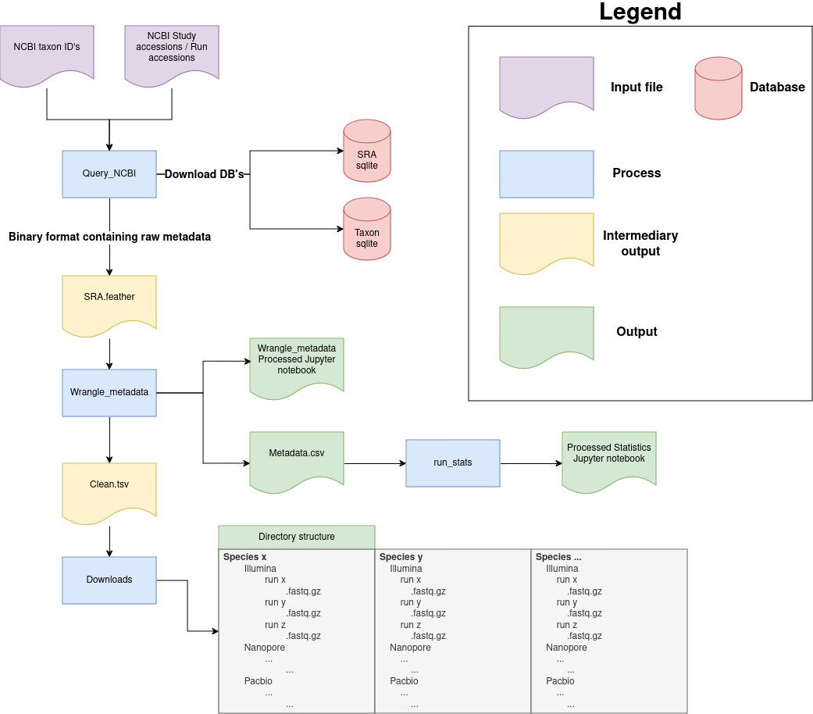

# Pipeline for downloading samples from NCBI with Metadata
This snakemake pipeline takes NBCI taxon IDs, study accessions, and run accessions and finds all associated samples. Next, metadata for the collected samples is fetched and cleaned. Finally, samples are downloaded in parallel. 



## Instructions
You must install Snakemake with Jupyter notebook support in a conda/mamba environment to run the pipeline. Please refer to the [Snakemake documentation](https://snakemake.readthedocs.io/en/stable/getting_started/installation.html) for installation instructions. 


Snakemake pipelines can be run locally on your computer or on High Performance clusters with job schedulers. Please refer to the [Snakemake documentation](https://snakemake.github.io/snakemake-plugin-catalog/index.html) on how to set up a configuration for specific job schedulers. 
### Run locally without a config
```bash
git clone https://github.com/bayraktar1/reconstruct_plasmids_snakemake.git
cd reconstruct_plasmids_snakemake

# Find samples and collect their metadata
snakemake -s workflow/metadata.smk --cores <number of cores> --use-conda --latency-wait 60 --printshellcmds

# Before downloading, please review the metadata.csv output and make adjustments to the clean.tsv if desired.
snakemake -s workflow/downloads.smk --cores <number of cores> --keep-going --use-conda --latency-wait 60 --printshellcmds
```
`Metadata.smk` should NOT be run with `--keep-going`, all rules should always finish without errors. <br>

`Downloads.smk` should be run with `--keep-going` as files belonging to certain accessions might no longer be available, which means that the rule for that accession will fail. This could also occur if  a sample is invalid, in which case it will fail during fasterq-dump.

## Recommendations and warnings
- Please be aware that you could download considerable amounts of samples using this pipeline and run out of storage space quickly.
- It is recommended that you first explore the `metadata.csv` that is output by the `metadata.smk` before downloading the samples.
- You can make adjustments to the `clean.tsv` output to adjust the samples that will be downloaded.
- It is recommended that you pass 10–20 cores to downloads.smk to significantly speed up downloading samples.
- If the download of the SRA database dump fails, you could download it manually from [here](https://gbnci.cancer.gov/backup/SRAmetadb.sqlite.gz) and place it in the `Data/` directory.

## Selecting species & accessions
You can specify NCBI taxon IDs in `Data/taxons.txt`. Single or multiple taxons can be specified separated by a space. **If you specify a taxon ID that belongs to a rank higher than a species, all species of that rank will be downloaded!**

Sample accessions and study accessions can be specified in `Data/accessions.txt`. All samples associated with a study will be collected and downloaded.

You can combine them as long as you specify everything in their respective files.

**Samples that fall under "strains" in the NCBi database are currently not found when searching through a higher taxon rank.**

# Roadmap
- [ ] Ensure that samples classified as strains are found by SRA-Data-Collector
- [ ] Simplify passing taxon IDs and accessions
- [ ] Move away from Snakemake and make an independent package
- [ ] Move away from SRAdb
- [ ] Expand processing of Country names beyond INSDC list with fuzzy searching
- [ ] Improve processing of sample sources names by creating categories/groups


## License

MIT License

Copyright (c) 2024 Doğukan Bayraktar

Permission is hereby granted, free of charge, to any person obtaining a copy
of this software and associated documentation files (the "Software"), to deal
in the Software without restriction, including without limitation the rights
to use, copy, modify, merge, publish, distribute, sublicense, and/or sell
copies of the Software, and to permit persons to whom the Software is
furnished to do so, subject to the following conditions:

The above copyright notice and this permission notice shall be included in all
copies or substantial portions of the Software.

THE SOFTWARE IS PROVIDED "AS IS", WITHOUT WARRANTY OF ANY KIND, EXPRESS OR
IMPLIED, INCLUDING BUT NOT LIMITED TO THE WARRANTIES OF MERCHANTABILITY,
FITNESS FOR A PARTICULAR PURPOSE AND NONINFRINGEMENT. IN NO EVENT SHALL THE
AUTHORS OR COPYRIGHT HOLDERS BE LIABLE FOR ANY CLAIM, DAMAGES OR OTHER
LIABILITY, WHETHER IN AN ACTION OF CONTRACT, TORT OR OTHERWISE, ARISING FROM,
OUT OF OR IN CONNECTION WITH THE SOFTWARE OR THE USE OR OTHER DEALINGS IN THE
SOFTWARE.
