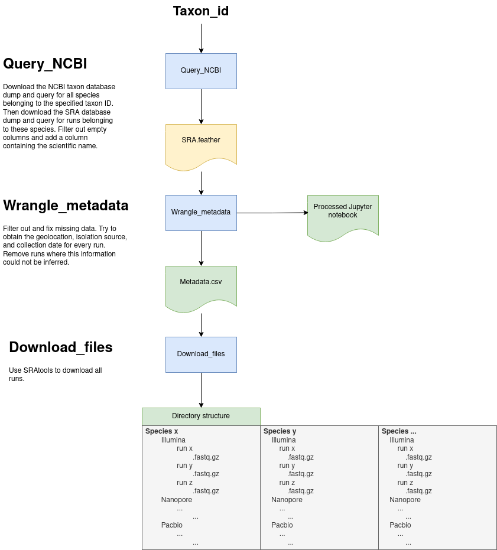

# Pipeline for downloading samples from NCBI

## Instructions
```bash
git clone https://github.com/bayraktar1/reconstruct_plasmids_snakemake.git
cd reconstruct_plasmids_snakemake

snakemake -s workflow/metadata.smk --executor slurm -j 20 --default-resources slurm_account=dla_mm slurm_partition=cpu --use-conda --conda-frontend mamba --latency-wait 60 --printshellcmds
snakemake -s workflow/downloads.smk --executor slurm -j 20 --default-resources slurm_account=dla_mm slurm_partition=cpu --use-conda --conda-frontend mamba --latency-wait 60 --printshellcmds
```

## Flowchart

